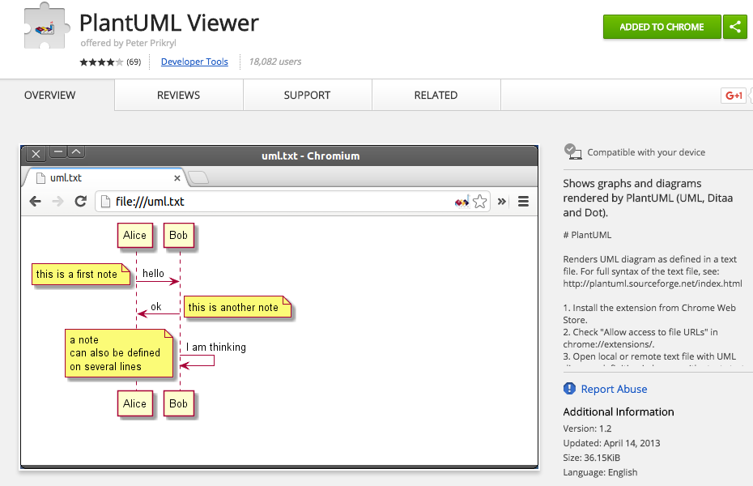

# Contributor Guide 

## Article Names

Use the file name 'README.md' for the main component description.  This file should be placed in a folder directly below the name of the Subsystem to which the component belongs.  The name of the folder should be the name of the component, in lower case, with hyphens used where spaces appear in the component name.   

For example, the 'Share App' component should be placed in a folder named 'share-app', as in 
```
/system/subsystem/share/share-app/README.md
```

For other files, such as resource files, similarly use lower case and hyphens.  

For example,
```
/system/subsystem/share/share-app/resource/sequence/client-login-sequence.puml
```

When the architecture of a component is different enough that it warrants a new component description, add the name of the version to the end of the name of the folder containing the component description.  
 
For example, suppose the component description of the 'Versions' component, along with the associated resource files is stored in a folder named 'versions' as in 
```
/system/subsystem/repository/meta-data-services/versions
```
When a new version is introduced, then that new version can be named 
```
/system/subsystem/repository/meta-data-services/versions-2.0
```
and the previous version can be named 
```
/system/subsystem/repository/meta-data-services/versions-1.0
```

## Structuring a Component Article

A Component Article describes one component of the Subsystem. When creating a Component Article, use this [template](./component-template.md) so you cover all the important aspects of the architecture of that Component.

A Component Article is also used as a design document template.   When starting the design of a new component, start with a [template](./component-template.md).  While the design is being worked on, certain sections of the article will be left blank until the design and implementation have proceeded far enough to complete them.  An example of such a section is the Class Diagram.   While the component is being designed, use a Badge that marks it as a 'Work in Progress'(see below).   

If a section of the template has not yet been completed, leave that section empty.

If a section of the template does not apply to this component, add the text 'Not Applicable'.

Remember that someone should be able to read, digest and understand the component in around 2 - 3 hours.  Keep the level of detail appropriate to this timeframe.  You can always create sub pages if there is too much to cover in this timeframe.

## Badges

Badges should be used to signify the completeness of the article and the version to which a component article applies.  There are two badges that can be used.

### Article Completeness Badge
This should be used to signify the level of completeness of the article.  It should be placed directly below the article title.  It takes the form ...

For Completed Articles: 
```
https://img.shields.io/badge/Document_Level-Complete-green.svg?style=flat-square 
```
For Works in Progress: 
```
https://img.shields.io/badge/Document_Level-In_Progress-yellow.svg?style=flat-square
```
For Articles that have not yet been started: 
```
https://img.shields.io/badge/Document_Level-Not_Started-red.svg?style=flat-square
```

### Version Badge

This should be used to signify the version to which an article, or a portion of article applies.  It takes the form ... 

``` 
https://img.shields.io/badge/Version-<version>-<color>.svg?style=flat-square

where
<version> = The latest version to which the article applies, e.g. 5.1
<color> = green for Alfresco One 5.1 | orange for Alfresco Content Services 5.2 | blue for Alfresco future
```
e.g. 

Use a Version Badge at the top of the article, directly below the Completeness Badge, to signify the version of the product to which the article primarly applies.   If a portion of the article pertains to a particular version, use a badge for that particular section, to signify that that section only applies to a particular version.  That may mean that sometimes there are multiple sections, each for a different version.

**NOTE**: Not all components follow the same versioning scheme (e.g. the *Google Docs Connector* has a different versioning scheme than *Alfresco Content Services*).  So feel free to choose a color scheme from the available colors in shields.io, e.g. 

## Design Artifacts

At any level in the Map, an author may find it useful to include graphics or other renditions of Design Artifacts that help explain details of that component.  For example, when describing the *Versions* component it may be useful to include a UML sequence diagram that illustrates the message flow for auto-creation of versions.  

Design Artifacts are stored in folder called **resource**.  Within the **resource** folder, you can create sub-folders that describe the type of design artifact it is.   Use the following names for these sub-folders:

* class
* component
* concept
* data
* etc
* sequence

Not all components are expected to have Design Artifacts of all of these types.  

### Generating Images

Use PlantUML wherever possible to create design artifacts (UML diagrams, flow diagrams, models).  A PlantUML reference can be found [here](http://plantuml.com/PlantUML_Language_Reference_Guide.pdf).  Such artifacts are used to generate images as part of the [Map build plan](https://bamboo.alfresco.com/bamboo/browse/SRVC-MAP).  If you create a Design Artifact using PlantUML, store the source code for that artifact in a sub-folder based upon the kind of artifact it is, using this pattern.

```
https://github.com/Alfresco/arch-map/system/subsystem/<subsystemname>/<componentname>/resource/<type>/<file-base-name>.puml

where ...
subsystemname = one of the subsystems
type = class | component | concept | data | etc | sequence 
file-base-name = some file base-name
```
Having created a Design Artifact like that, when the build completes, you will find the generated image here ...

```
https://github.com/Alfresco/arch-map/system/subsystem/<subsystemname>/<componentname>/resource/<type>/<file-base-name>.png
```

For example, the UML sequence diagram that describes the flow for 'Uploading a New Alfresco License' will be generated from 
```
https://github.com/Alfresco/arch-map/blob/master/system/subsystem/infrastructure-and-services/license/resource/sequence/license-upload-license-sequence.puml
```
and stored, by the Build, here ...
```
https://github.com/Alfresco/arch-map/system/subsystem/infrastructure-and-services/License/resource/sequence/license-upload-license-sequence.png
```

### PlantUML Style Guidelines

Here are a few tips:
* Don't use the 'handwritten' skin ... it has the side-effect of generating a slightly different image each time (simulating human randomness) which confuses Git
* Don't include your own footer since the PlantUML config file (described below) will then be ignored
* Don't specify your own colors for elements in the diagram.  Instead let the color scheme specified in included *plantuml* file be used.  If you
must specify your own colors for some reason, use one of the colors from [Google Material Design](https://material.google.com/style/color.html#color-color-palette)

### Generating Class Diagrams from Java

It is possible to generate a class diagram from Java source using a Maven plugin.   The plugin is still in development (not yet in Maven Central) but you can install it into your local Maven repository by cloning the Git repo at https://github.com/juanmf/Java2PlantUML.git and then running 'mvn install'.  You can then employ the plugin by including the following in your Maven pom...
```
  <build>
	<plugins>
		<plugin>
			<groupId>com.github.juanmf</groupId>
			<artifactId>java2PlantUML-maven-plugin</artifactId>
			<version>1.0.1</version>
			<configuration>
				<goalPrefix>java2PlantUML</goalPrefix>
				<parse.relationTypeFilter>FILTER_ALLOW_ALL_RELATIONS</parse.relationTypeFilter>
				<parse.classesFilter>FILTER_FORBID_ANONYMOUS</parse.classesFilter>
				<parse.relationsFilter>FILTER_CHAIN_RELATION_STANDARD</parse.relationsFilter>
			</configuration>
		</plugin>
	</plugins>
  </build>
```

To generate the class file, run a Maven build like this...
```
mvn -Dparse.thePackage=com.alfresco.services.lambda -Dparse.classesFilter=FILTER_FORBID_ANONYMOUS clean compile java2PlantUML:parse
```
and the result will be a txt file that contains the PlantUML source for the class diagram.  More work needs to be done to improve th plugin and automate the process, but it can be a useful assist even now.   An example of a PlantUML file created in this fashion is [here](https://github.com/Alfresco/arch-map/blob/master/system/subsystem/repository/nosql/tenant/resource/class/tenant-class-generated.puml).

### The PlantUML Config File

The file stored here 
```
https://github.com/Alfresco/arch-map/blob/master/config/plantuml.config
```
 contains PlantUML directives that are automatically
included at the beginning each PlantUML file processed by the build.   It includes a footer that includes a Copyright
statement as well as a statement that stamps the file as generated so as not to confuse an author into changing a 
generated file.

### The PlantUML Viewer in the Chrome Web Store

You may also find it useful to install the [PlantUML Viewer](https://chrome.google.com/webstore/detail/plantuml-viewer/legbfeljfbjgfifnkmpoajgpgejojooj).  This plugin will allow you to see a preview of the image that will be produced by a PlantUML file. 



### Other Kinds of Design Artifacts 

If you cannot use PlantUML to create the Design Artifacts (for example, a photograph of a whiteboard from a design session) you can store the artifact directly using a git commit.  

```
https://github.com/Alfresco/arch-map/system/subsystem/<subsystemname>/<componentname>/resource/<type>/<file-name>

where ...
subsystemname = one of the subsystems
type = class | component | concept | data | sequence | document 
file-name = some file name
```
For example, you could store a photo of a white board like this ...
```
git clone https://github.com/Alfresco/arch-map.git
cd map/system/subsystem/repository/nosql/tenant
mkdir resource;mkdir concept;cd resource/concept 
cp ~/home/camera/images/whiteboard/photo.jpg ./tenant.jpg
git add .
git commit -m 'added whiteboard picture'
git push origin master
```
and then the image could be referenced as 
```
https://github.com/Alfresco/arch-map/system/subsystem/repository/nosql/tenant/resource/concept/tenant.jpg
```

## Using Git

To access the source for the Map, you can clone the repo, thusly...
```
git clone https://github.com/Alfresco/arch-map 
```
Once you have the repository, you can use any IDE, such as IntelliJ or Eclipse, that has a git plugin or you can use GitHub desktop.  If you are using IntelliJ or Eclipse, you can install plugins that understand markdown and PlantUML markup to have a more interactive experience when previewing changes to either the markdown pages or to the Design Artifacts. 

## Pull Requests

If you have a change you want to contribute, fork the repo, make the change and create a Pull Request.  The request will be reviewed and merged, as appropriate.

## Building the Design Artifacts

The source for the Design Artifacts is the content of the Plant UML files stored as files in this git project.  Images from these Design Artifacts are generated using a maven *plugin com.github.jeluard:plantuml-maven-plugin*.  To execute the build, run this command
```
mvn clean com.github.jeluard:plantuml-maven-plugin:generate
```
Observe the generated images are stored as PNG files in the target directory created by the build.  When run from Bamboo, these images will be collected and stored in https://dev.alfresco.com/design/gallery/generated. 

NOTE: To generate the images you will need to install the [graphviz](http://www.graphviz.org) utility on your system.

## IDE and Editor Support 

### Using Eclipse

NOTE: The instructions below are targeting Eclipse Luna, later versions may differ slightly.

#### Git Enablement

Since the content of the Map is a git project, it can be accessed and edited in Eclipse.  

1. Select Help | Install New Software
2. Enter Work with: 'egit - http://download.eclipse.org/egit/updates'
3. Select 'Eclipse Git Team Provider'
4. Click 'Next'

#### PlantUML Plugin

1. Select Help | Install New Software
2. Enter Work with: 'http://basar.idi.ntnu.no/svn/tdt4100/anonymous/trunk/updatesite/'
3. Select 'PlantUML'
4. Click 'Next'

#### Setup the Map Project

1. Select File | Import | Git | Projects from Git
1. Click 'Next'
1. Select 'Clone URI' 
1. Click 'Next'
1. Enter Clone URI details
  * Clone URI: 'https://github.com/Alfresco/arch-map.git'
  * Host: 'github.com'
  * Repository path: '/Alfresco/arch-map.git' 
  * Protocol: 'https'
  * Port: blank
  * User: *your userid*
  * Password: *yourpassword*
1. Click 'Next'
1. Select 'master' 
1. Click 'Next'
1. Enter Location Details
  * Directory: some local directory, e.g. '/Users/drfoo/development/git/arch-map'
  * Initial branch: 'master'
  * Remote name: 'origin'
1. Click 'Next'
1. Enter Import choices
  * Select 'Import as general project'
  * Select 'Working Tree'
1. Click 'Next'
1. Enter Project details
 * Project name: some name e.g. 'ArchitectureMap'
 * Directory: leave as-is
1. Click 'Finish'
1. Build it like this ...
  1. Select the Project and right click 'Convert to Maven Project'
  1. Select the Project and right click 'Run as->Run Configurations'
  1. Add a Run Configuration with 
    * Base Directory: '${workspace_loc:/ArchitectureMap}'
    * Goal: 'clean com.github.jeluard:plantuml-maven-plugin:generate'
  1. Click 'Run'
  1. Observe the build creates PNG files in the target directory


### Using IntelliJ

Since the content of the Map is a Git project, it can be accessed and edited in IntelliJ.  

#### Git Enablement

IntelliJ bundles a Git plugin, but it is still necessary for you to have Git installed locally (version 1.7.1.1 or later) and point to the location in IntelliJ IDEA | Preferences | Version Control | Git on Mac OSX and File | Settings | Version Control | Git on Windows and Linux.

#### PlantUML Plugin

An integration for PlantUML is available for IntelliJ, the way this is installed depends on the version of IntelliJ.

##### Version 2016.1.2 or later

Select IntelliJ IDEA | Preferences | Plugins click 'Browse Repositories...' and enter 'PlantUML' and then select 'PlantUML Integration' from the list and then click the green 'Install' button.

##### Version 15.0.3 (Community)

Select IntelliJ IDEA | Preferences | Plugins and enter 'PlantUML' in the search field, select 'PlantUML Integration' from the list and then click the green 'Install' button.

#### Setup the Map Project

1. File | New | Project fromVersion Control | GitHub, then enter your user name and password.  
1. On the next dialog you can decide if you want to enable master password protection or not.  
1. Enter
  * Git Repository URL: https://github.com/Alfresco/arch-map
  * Parent Directory: e.g. /Users/drfoo/IdeaProjects
  * Directory Name: e.g. ArchitectureMap
1. Click 'Clone'
2. When you see the warning 'Non-managed pom.xml file found: /Users/drfoo/IdeaProjects/ArchitectureMap/pom.xml Add as Maven Project or Disable notification' click 'Add as Maven Project' 
3. The project is then cloned.   Now you can edit the PlantUML files.   Observe that the PlantUML plugin allows you to see the diagram as it will be produced by the build step later.
4. View | Tool Windows | Maven Projects select the project in the list of Maven Projects and then right click and select 'Create Run/Debug Configuration', specifying ...
  * Working directory: e.g. /Users/drfoo/IdeaProjects/ArchitectureMap
  * Command line: plantuml:generate
5. Right click the configuration you just created, select Run and you will see the Build start.  When it is complete you will notice the images have been created in the 'target' directory.   Note: You may see a warning about the need to configure a JDK.  If you do, select a Java JDK and continue.


### Using Visual Studio

Download [Microsoft Visual Studio](https://code.visualstudio.com/Download) and run it.

Since the content of the Map is a Git project, it can be accessed and edited in Visual Studio.  

1. On the main page, click Start | Clone Git repository, then enter the url of this repo https://github.com/Alfresco/arch-map.git
2. On the following file dialog, choose a location into which to clone the repo and hit enter ... observe the progress of the clone operation in the bottom portion of the window

#### PlantUML Plugin

An integration for PlantUML is available as [a plugin for Visual Studio](https://marketplace.visualstudio.com/items?itemName=jebbs.plantuml)

To install it, follow these steps
1.  Click on the Extensions icon in the left tool bar of the main page
2.  Enter 'PlantUML' and observe the list of extensions
3.  Click the green 'Install icon for the *PlantUML* plugin (1.30 or later)
4.  Once the plugin is installed the icon turns blue and has the text 'Reload'
5.  Click the blue 'Reload' button and confirm the next dialog
6.  From now on, when you open a PlantUML file, a preview is available

### Using Sublime

Download [Sublime Text](https://www.sublimetext.com/download) and run it.

#### PlantUML Plugin

An integration for PlantUML is available as [a package for Sublime Text](https://github.com/jvantuyl/sublime_diagram_plugin)


1.  Open Sublime Text 
2.  Click on 'Tools | Command Palette | Install Package Control'
3.  Click on 'Tools | Command Palette | Add Repository'
4.  Enter 'Enter https://github.com/jvantuyl/sublime_diagram_plugin' and observe the confirmation at bottom of window
4.  Click on 'Tools | Command Palette | Install Package'
5.  Enter 'sublime_diagram_plugin' and observe the confirmation at bottom of window

Thereafter, the key combination of *super-m* (The *⌘ (Command)+ m* on Mac OSX or the *Windows + m* key on Windows ) will display the diagram for an open PlantUMLfile.


