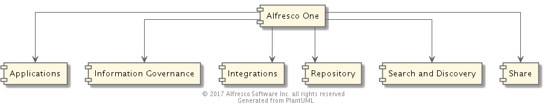

# Alfresco Map

You've found the GitHub repository that houses the technical documentation that describes the architecture of Alfresco.

## 
 
## Map Organization

### Subsystems

The Map is organized into six Subsystems.  Each Subsystem has a page where you'll find an overview and a list of Articles. 
Each Article is a page describing one Component of the Subsystem.  For example, the *Share* Subsystem is described in [this page](./subsystem/share) and that Subsystem contains a number of Components such as the *Share Application* Component [here](./subsystem/share/share-app) and 
the *Web Quick Start* Component [here](./subsystem/share/web-quick-start).

#### System Components

* [Applications](./subsystem/applications)
* [Information Governance](./subsystem/information-governance)
* [Integrations](./subsystem/integrations)
* [Repository](./subsystem/repository)
* [Search and Discovery](./subsystem/search-and-discovery)
* [Share](./subsystem/share)

## Contribute to the Map
The Architecture Map is a work in progress.  So don't be surprised by missing pages. If you are interested in filling in these gaps by contributing to the Map, see [The Contributor Guide](../contributor-guide.md).

**Note**: The public Architecture Map repository only contains descriptions of components that are part of the Community version.
