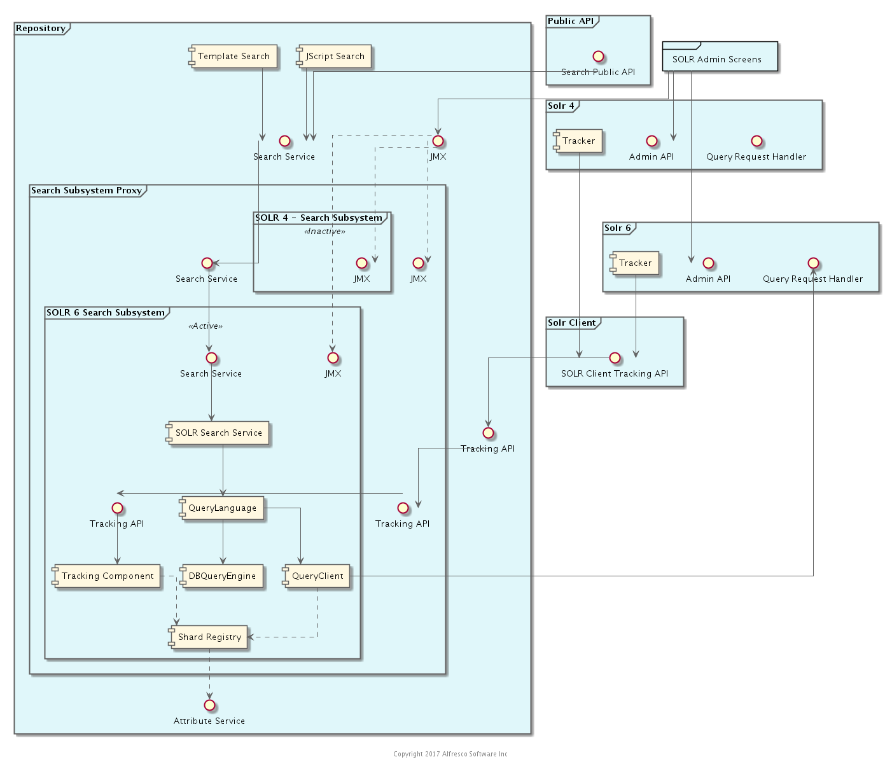

# Search and Discovery

## Welcome to the Search and Discovery Subsystem

### Architect: Andy Hind

### Overview  

There are two APIs: one to track changes and support building an index; and one to execute queries.

### Componentisation

#### Tracking API

The API by which SOLR tracks the repository is well defined and has been extended in a backward compatible way.
For example, a SOLR 6 index can read information from a 5.1 repository; with some limitations on support for new ways of sharding the index.
Deploying new features in this API is not easy; it is tied to the Search sub-system in the repository.
It requires a new repository release or a new implementation of the sub-system to be deployed.
Again, this is painful as it would require updates to existing administration screens. 

#### Querying & The Public API

The Search sun-systems for SOLR 1, 4 & 6 build specific queries against each index.
Changes to SOLR query and response behaviour are encapsulated in the wrong place. Updating to the next versions of SOLR may require a repository updated.

The sub-system should be changed to a decorate and forward design. The public API JSON is decorated with security information etc by the repository and then sent to SOLR.
In effect, we need to add our own stable query API to SOLR.
This would allow us to expose new functionality by upgrading SOLR and supporting new elements in the request that is passed through.

At the moment the Public Search API is implemented using the Java API. The Java API should be deprecated and build requests using a new pass-through Java API for the public API.  

#### TMDQ

There still needs to be some query support in the Search sub-system to execute suitable queries against the database, when requested.
If we move from an all DB persistence layer this will have to be revisited. 
There is therefore some common code in the data model project.

#### Administration

The administration screens require code in the enterprise API and enums etc in the "core" and "data-model" projects.
This also needs to be split. 

### Pull vs Push vs SOLR Cloud

SOLR or any other index is not our system of record.
We can always go and get the truth and a log of how things changed for documents.

#### Why not just use SOLR Cloud?

SOLR cloud requires Zookeeper. There seem to be mixed devops views on this. 
However, Zookeeper on premise does not make a lot of sense.
SOLR cloud is also currently a synchronous push model. 
In 6.4 this changes to allow a leader - replication model more like old school  SOLR 1.4 shard replication but that is zookeeper friendly. 

A synchronous push to all replicas of a shard has significant impact:
* Zookeeper pain in the cloud and on premise
* All shard instances are in sync at the same state
* If all replicas are not in sync they play catch from the query log or pull the whole index in a single copy
* Cross data centre replication is asynchronous anyway ......  
* See Push below

#### Push

Surely you can just stream updates via a persistent queue. Job done?

* Do you really know what to push? 
* Who pushes it? 
* When do they push it? 
* What happens when you restore a back up that is two hours old? 
* Can I replay my queue? 
* What if I want to change the way something was indexed? 
* What if something went wrong with a text transform?
* Where do I log what needs to be resent/retried?  
* How do I migrate my index? 
* How long does my queue persist? 
* What should go live into the index together?
* How do things get batched?
* What needs to be consistent?
* Does it matter if the index is not complete/correct?
* Where does the transformed content get cached? (We will need it again to do highlighting and possibly some clever stuff with AI .....)
* Do you index metadata and content at the same time?
* Are we pushing to indexes in the same version configuration?
* What do we really need to now about the version and state of the indexes? Do we have to pull its models to map queries to the schema it is using?

Fundamentally:
* an index has a state 
* every replica of an index  may not be in the same state (stuff goes wrong)
* the state affects what needs to be sent to the index
* the state affects recovery
* it's not just stuff as it happens  

To resolve these issues some process needs to check the state and decided what to send 

At this point you should be convinced there is some supervising process that needs to decide what to do and how to coordinate it.
If not you are going to have fun when the support call comes in and asks "Why is document x not found by my query?"   

The question are: 
* where do we locate and scale this process?
* where do we record errors?
* how do we resolve errors?

#### Pull

Let's consider locating the supervising process in the index, that all the configuration we need is local and we go to fetch the information we need.

Then:
* each index is independent
* replicas do not need to be in the same state - there is no brain to split
* indexes track at their own rate
* replicas can be in different availability regions and availability zones (that may be helped with read replication)
* indexes can report/broadcast their state - we do not need zookeeper 
* the index can be updated in batches (in parallel) 
* state can be indexed
* it's easy to split metadata from content
* it's easy to prioritise metadata over content
* we do not fetch content if we do not need it
* indexes in an unhappy state can be excluded 
* recovery is easy - the state got backed up
* rebuild is easy - we pull what we want to rebuild
* rebuilding the whole thing is easy 
* coordinating and committing chunks to go live is easy
* it scales - creating an index creates the process to create and manage it 
* errors can be  recorded in the index - they can be retried
* if lucene adds some super new complex type for points and other numerics we can reindex to use them (this was added to lucene but not in SOLR 6.3)
* we are not left with legacy indexes 
  
Yes, this could be something else to scale and manage in the middle.
   
There are other things that make sense to locate and customise in SOLR that also depend on state 
Versioning of configuration, schema etc is encapsulated at the index. 

### Components

* [x] [Search and Discovery Public API](./search-public-api)
* [ ] Search Services
* [ ] [Query Languages](./query-languages)
* [ ] Transactional Metadata Query - TMDQ
* [x] [Lucene](./lucene)
* [x] [SOLR Tracking Client](./search-tracker)
* [ ] SOLR 1
* [ ] SOLR 4
* [ ] SOLR 6

