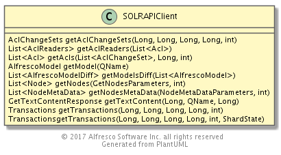
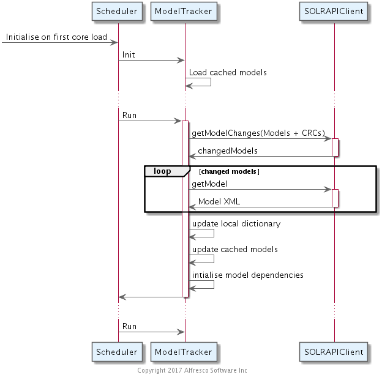
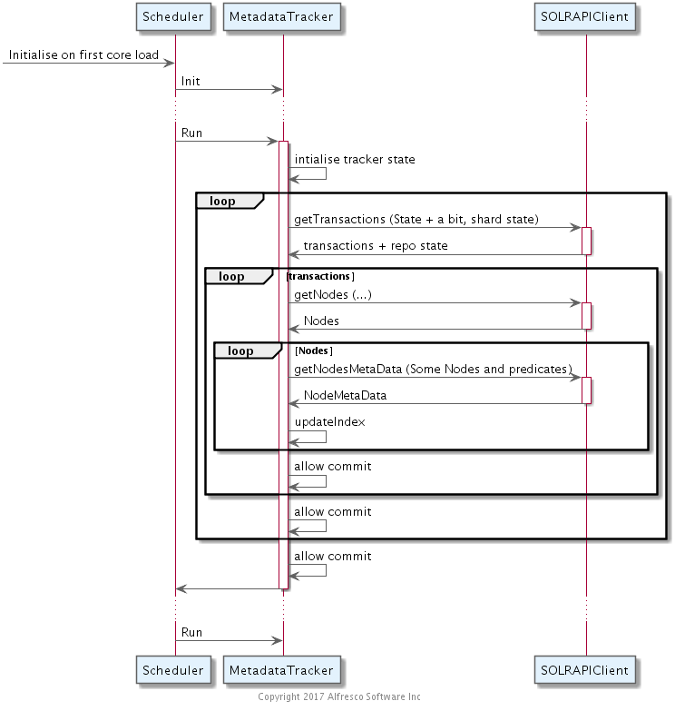
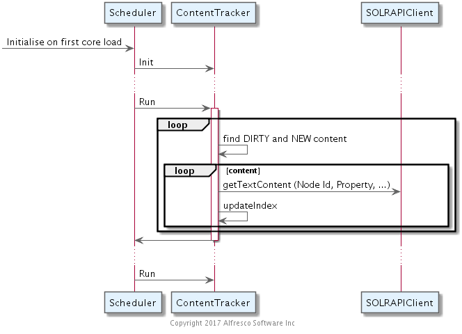
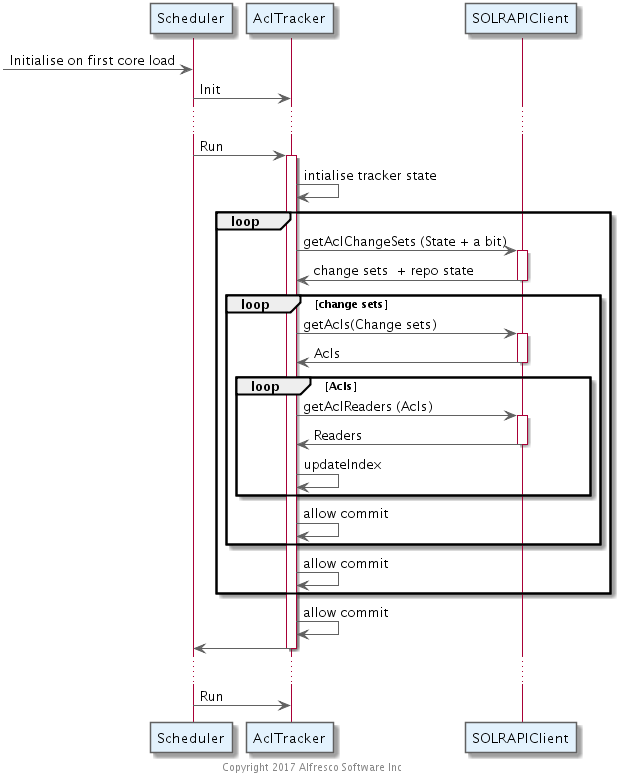

## Search Tracker

### Purpose

SOLR pulls models, metadata, access control and content from Alfresco and builds an index that can be queried while enforcing access control.

*** 

### Overview 

Metadata, Access control and Content are tracked separately. This section describes how the trackers pull information using the SOLRAPIClient.

 

#### Model Tracker

The SOLR Client provides a mechanism to check for updated models in Alfresco.
Each model has a checksum. The API expects a set of model names and associated checksums.
It returns a summary of how  models have changed based on these criteria.
Models may have been removed, updated or added.
The SOLR Client API supports fetching added or updated models by name.

In general, models do not change frequently.
The API is not tenant aware and will not currently recognise tenant specific models.
**This does not support tenant specific models**

Model changes may be incompatible with an existing index.
The changes that are allowed for dynamically updated models are supported: any other changes are not.
Unsupported changes could affect how data is indexed and queried and therefore cause queries to fail.
Model update failures have to be resolved by hand and are intend to protect customers from breaking model changes.
Some examples of incompatible changes are: changing the data type of a property; changing a property from single to multi-valued, or the reverse; a property is indexed, or not; 
changing tokenisation or identifier behaviour for a property; and changing faceting requirements.

In general, these changes would require a reindex to fix the query behaviour of previously indexed information.

The models are assumed to apply to all indexes in a single SOLR install. An index server can not support multiple repositories with differing models.

The tracker state is the in memory data dictionary which is cached on disk.

 

#### Metadata Tracker

Some how the client determines the state of what it has done before.
This typically requires going back an extra hour to allow for long running DB transactions which may have been in process the last time the tracker ran.

Draw a line in the sand to determine where we will stop.
Typically a few seconds before now.
This avoids doing extra work. Nodes are typically updated repeatedly for a short period of time. 

The SOLR client API supports pulling transaction information from alfresco using bounding commit times and/or transaction ids and some numerical limit.
This returns a list of transaction information matching the predicate and some state about the maximum transaction commit time and transaction id in the repository at that time.
This allows any client to get the next batch of information and also know how many more transactions it may have to do. 
The tracking call can also report back shard/index state to the repository to be used in dynamic index index construction.

The API returns the transaction id, transaction timestamp, number of updates/additions and number of deletions for each transaction.

A user of the tracking client an use this list of transaction to go and pull the next level of detail for each transaction.
This comprises the list of nodes affected by some set of transaction ids and some other predicates.
Each node knows its id, node reference, transaction id, status (updated/deleted), tenant, aclID, and optionally a key used for shard assignment.

Given this information the client API can be used to go and pull the metadata for batches of nodes.
This metadata includes all properties and a description of content properties and how to get the content but not the content itself.

It is possible that nodes are updated and move onto a later transaction during this process.
Users of the API should check that any nodes returned are indeed in the transaction they expected.

Node can be fetched in batches, in parallel and updated by many threads.
Some commit coordination is required to make sure that information goes live in the index in transactional chunks.
In SOLR 4 this coordination is done with locking; in SOLR 6 a commit tracker takes care of this.
The SOLR 6 approach avoids blocking index updates while the index is warming and increases the concurrency of multi-threaded metadata tracking.    

The tracker state is explicitly stored in the index - the last transaction added to the index (ordered by transaction commit time and then transaction id)  
A transaction document is written to the index after all the nodes operations for that transaction are complete. 
If this transaction record is in the index then all the updates for that transaction were applied to the index.
The tracker rechecks that the transactions for some period prior to its last known transaction are present.
Database transactions are normally allowed up to an hour to commit so may appear up to an hour in the past.

 

#### Content Tracker

When metadata is indexed some content information is added but not the content itself.
The description of the content contains the mimetype, encoding, locale, size and the URL to the content.
If we have indexed the node before it is easy to tell if the content has changed.
If the content has not changed, the process of metadata indexing can use a locally cached text rendition of the content to update the content part of the index.
If the content has changed the old content is reused with the updated metadata and the node is marked as requiring the content to be updated.

Transforming many forms of content to a text rendition may be slow and resource intensive.
This is why it is split out from metadata indexing. We want the index to reflect metadata changes quickly and not be slowed by text trnaformation.

When a node is added to the index it is tagged as NEW, CLEAN, or DIRTY.
The content tracker finds NEW and DIRTY content in the order the metadata has been updated and coordinates fetching the updated content and updating the index.
By its nature content is transformed one at a time.      

When content goes live does not require specific coordination 

The state for this tracker is expressly stored on the nodes when indexed.

 

#### ACL Tracker

Some how the client determines the state of what it has done before.
This typically requires going back an extra hour to allow for long running DB transactions which may have been in process the last time the tracker ran.

Draw a line in the sand to determine where we will stop.
Typically a few seconds before now.

The SOLR client API supports pulling changeset information from alfresco using bounding commit times and/or changeset ids and some numerical limit.
This returns a list of changeset information matching the predicate and some state about the maximum changeset commit time and changeset id in the repository at that time.
This allows any client to get the next batch of information and also know how many more changesets it may have to do. 

The API returns the changeset id, changeset timestamp and acl count for each changeset.

A user of the tracking client can use this list of changesets to go and pull the next level of detail for each acl.
This comprises the list of alcs affected by some set of changeset ids and some other predicates.
Each acl knows its id and changeset id.

Given this information the client API can be used to go and pull the readers for batches of ACLs.
For each ACL there is a list of authorities that are allowed READ, a list that are DENIED READ and changeset id and a tenant context.

State is stored using the same approach as the metatracker.

 

#### Cascade Tracker

When the metadata is indexed for a node its PATHs are indexed.
Some operations can change the PATHs to a node without changing the node.
When this happens the node needs updating in the index even though it has not actually changed - only some things about one of its non-immediate ancestors has changed.

The operations that can causes such changes are: renaming a node's ancestor, moving a node's ancestor, and creating or removing links to a node's ancestor.

Tagging or categorising a node affect the specific node and does not cause cascade updates.   
 
When a node is updated in the repository a checksum is calculated of its parent associations.
If this changes, with respect to what is in the index, then the path to the node and its descendants has changed.  
Changing the child associations to a node will cause it to be reindex but not any of its descendants.
 
Prior to SOLR 6, this cascade update was done as part of metadata tracking. 
The scope of the cascade update can be large enough to cause significant additional lag.
In SOLR 6, this process was split out so that metadata updates and cascade updates can continue in parallel.

This tracker does not need to pull information from the repository.
When a node is indexed, the parent association check sum is compared with that already in the index.
If the checksum has changed, a record is made in the index that the node's descendants need reindexing.
This tracker queries for those records and does the update.

Cascade updates to PATHs are expected to take longer to be updated than metadata changes    
  
The properties updated by cascade are:
* related to PATH (PATH, SITE, TAG, tag based suggestion, structural faceting, APATH)
* related to paths based on ancestor names (NPATH, PNAME)
* ANCESTOR - this field is also used to find the nodes that need updating for a given cascade operation.

State for this tracker is stored in transaction documents in the index.
So the cascade tracker runs after the related metadata changes have gone live.

#### Commit Tracker

This coordinates the commits between the trackers already described.

Prior to SOLR 6, commit coordination was handled using an index read lock.
This lock was held during the new indexer warming phase reducing the level of concurrency that could be achieved.

In SOLR 6, this tracker coordinates commits from the ACL and metadata trackers and locks only for the index commit but not the index warm.
The other trackers can cope with partially committed updates.
It is possible to control the time between commits and when those commits go live. 
If a commit is in progress (there is a warming searcher) then the  commit will be delayed until the next time around.

On roll back, the commit tracker is responsible for rolling back all changes to the index.
As this affects all trackers it needs to wait for the read lock for all trackers.
The commit tracker is then responsible for clearing the tracker in memory states so that they all effectively restart from the last known good commit. 

Using a specific commit tracker improves concurrency.
No tracker has to wait for a commit; the commit tracker waits for the other trackers to pause in a suitable state.
Content updates can carry on in parallel with metadata updates and commits; it does not matter when content updates go live.

This tracker has no state other than the index has changes made by other trackers that we could commit.

#### Node level locking

Only one tracker may update any given node/document at any time. This avoids simultaneous conflicting updates to metadata, content or properties updated by cascade.

#### Tracker lifecycle

See the [start up and shutdown life cycle] (./search-startup-and-shutdown/README.md) for trackers.

*** 

### Artifacts and Guidance

* [Source Code] (https://gitlab.alfresco.com/search_discovery/solr/tree/develop/alfresco-search/src/main/java/org/alfresco/solr/tracker)
* Standard Alfresco License
* [Issue Tracker] (https://issues.alfresco.com/jira/projects/SEARCH)
* Documentation Link
* Enhancements should be submitted as pull requests to GitLab. Ideas and suggestions can be raised as issues in the issue tracker.

*** 

### Configuration

Currently the configuration applies to all  trackers; it should be per tracker.

### Performance Considerations

Use the support to batch fetch information.
The transformation of content is usually rate determining.

### Security Considerations

Protect the tracker APIs on the Alfresco side using certificates.

### Cloud Considerations

There are no specific cloud considerations. It is normal to have an Alfresco node dedicated to serving the SOLR tracking API requests.

### Quiz

