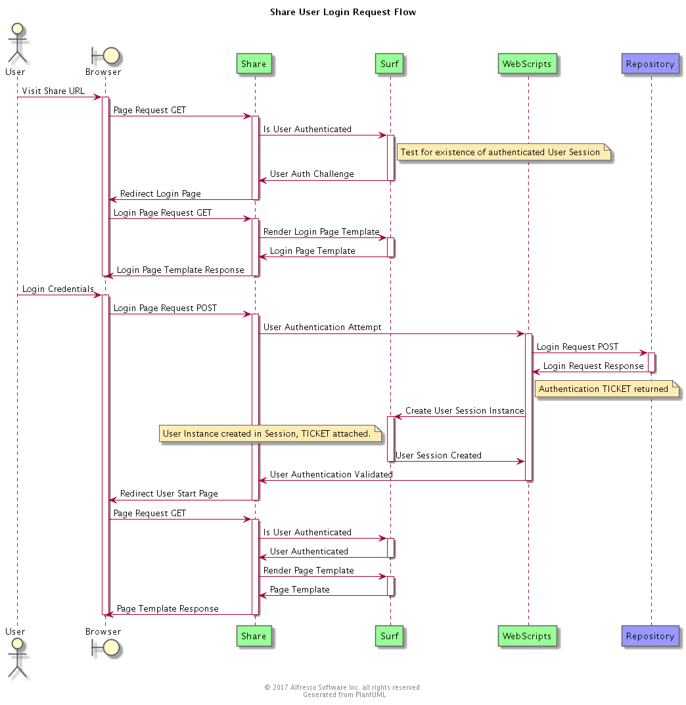

## Share Client Application

### Purpose

The primary goal of the Share Application is to provide a generic, [configurable](http://docs.alfresco.com/5.1/concepts/share-configuring-intro.html), [customisable](http://docs.alfresco.com/5.1/concepts/dev-extensions-share.html) collaboration platform client application for end-users. The web-application does not target any specific vertical but instead is an example of a web-client application that provides access to most of the Alfresco features mainly centred around general document management and basic collaboration use-cases. The product is built as an Alfresco Surf web-tier spring application and makes use of the Alfresco WebScripts REST platform for remote communication with the Alfresco repository.

*** 

### Overview

The Share Application is constructed from a number of layers that build upon each other and provide the services required for the complete client application.

1. Alfresco WebScripts REST framework.
2. Alfresco Surf web-framework.
3. Alfresco Share web-application.
4. Alfresco web-framework commons client-side framework (YUI2 based)
5. Alfresco Share client-side framework (YUI2 based)
6. Alfresco Aikau framework (Dojo based)

In addition, Share requires the "Share Services" legacy REST APIs to be deployed in the repository tier. A standard installed version of Alfresco will always have these REST APIs available. However since 5.1 Share and ShareService are separate AMPs that are not installed if a pure platform WAR version of Alfresco is manually deployed. The [Share Services AMP](http://docs.alfresco.com/5.1/tasks/simpleinstall-enterprise-lin-share.html) can be deployed into a pure platform Alfresco WAR if required post-installation. Since 5.1 Alfresco Share also makes use of the Alfresco Public REST API layer in the 5.1 repository platform.

*** 
### Governance

* Source Code Link: https://svn.alfresco.com/repos/alfresco-enterprise/web-apps/Share/trunk
* License: GNU Lesser General Public License (LGPL)
* Issue Tracker Link: https://issues.alfresco.com/jira/browse/SHA (MNT component: Share Application)
* Documentation: http://docs.alfresco.com/5.1/concepts/dev-extensions-share-architecture-extension-points.html
* Contribution Model: Alfresco Open Source

*** 
### Prerequisite Knowledge

* [Spring](https://spring.io/)
* [Spring Surf](http://docs.alfresco.com/5.1/concepts/surf-fwork-intro.html)
* [WebScripts](http://docs.alfresco.com/5.1/concepts/dev-extensions-share-surf-web-scripts.html)
* [Aikau](http://docs.alfresco.com/5.1/concepts/aikau-intro.html)

*** 

### Design

#### Component Model

The diagram below shows each of the Share high-level components deployed in a single application architecture.

DIAGRAM TO BE PROVIDED
*** 

#### Flows

##### Initial User Login Flow

This sequence diagram illustrates how an initial user login for the Share application configured with default TICKET based Alfresco login is handled.

#### Class Diagram

DIAGRAM TO BE PROVIDED
*** 

### Interfaces and API's

Share provides a number of client components and APIS. DETAILS TO BE PROVIDED.
Share requires the Share Service legacy REST API layer in the repository. DETAILS TO BE PROVIDED.

*** 

### Configuration

Share has a large number of configuration options. DETAILS TO BE PROVIDED.

*** 

### Performance Considerations

The Surf web-framework implements a number of caching mechanism to ensure that web-tier performance is excellent once caches are warmed and the initial page load for each view is completed. There will be a small delay on visiting each unique page for the first user in the system who vists that particular page, after that the page load for all subsequent users will be very rapid. Share was front-end application for both the data-loading and general browsing testing during the Alfresco 1 Billion document repository benchmark. It can support clustering of Share web-tiers to provide both performance and fail-over characteristics of a large system deployment. The Share web-tier runs in a standard Tomcat JVM container and the Tomct app-server should be tuned appropriately for the expected load and expected concurrent requests.
DETAILS ON TUNING FOR XYZ USERS TO BE PROVIDED.

*** 

### Security Considerations

The repository assures enforcement of access privileges. All operations in Share eventually proceed through the Alfresco Java API layer and ACLs are enforced by all Public services at the Java API layer. Additional role-based checks may be enforced by the Share application but all UI state should be considered transient and only the repository should be considered as the source-of-truth for all operations. i.e. all operations in Share could be repeated by direct invocation of the appropriate Alfresco REST APIs.

Alfresco Share is a web-application and therefore it is recommended that all available procedures are used to secure the /share endpoint. For examples, we strongly recommend the use of HTTPS, secure cookies, proxy for additional security layer, configuration of the built-in CSRF and SSO layer as appropriate.

*** 

### Cloud Considerations

Share has a private overlay project which adds/removes feature appropriate to the Cloud version of Alfresco Share. This repository and overlay project is not public but delivered only as part of the my.alfresco.com release schedule. 

