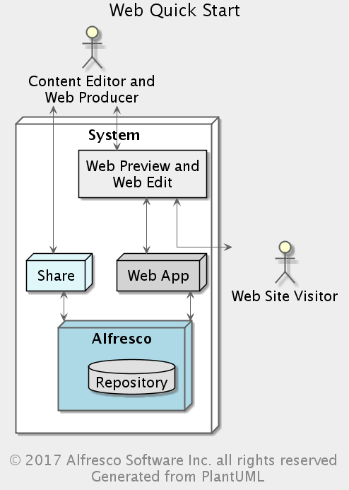
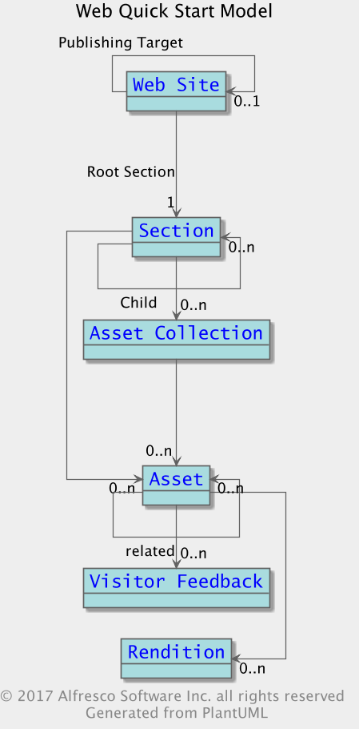
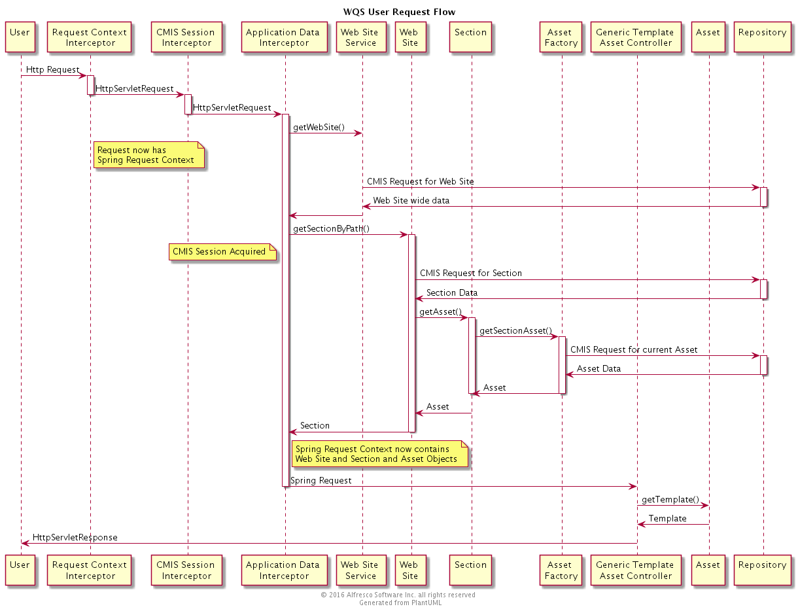

## Web Quick Start


### Purpose

The primary design goals of Web Quick Start is to illustrate the power of the Alfresco WCM platform in an easy-to-install package and to provide developers with a strong starting point for their Alfresco implementations. Both of these goals are fundamentally aimed at getting both business people and developers up and running with the Alfresco WCM platform in as short a time as possible. The Alfresco core product has not been changed in any way by Web Quick Start, just extended by plugging in a content model, behaviours and workflows using the many standard hooks provided by the Alfresco product.

*** 

### Overview 

All Web Quick Start is divided into four parts:

1. An Alfresco Module Package (AMP) that extends the Alfresco repository to support a generic website model
2. An AMP that extends Alfresco Share for editing content for the website, managing the structure of the website, and publishing content via workflow
3. A JAR file that contains a Java API for accessing the website data held in the repository
4. A web application (webapp) that, when deployed to a servlet container such as Tomcat, delivers a fictional financial news website. The webapp is a Spring MVC application, constructed using Spring Surf, and communicating with the Alfresco repository using the API mentioned above. As well as dynamically building the website from data held in the the Alfresco repository, the Quick Start webapp also provides examples of user generated content (UGC) whereby content is sent from the webapp back to the Alfresco repository.

*** 
### Governance

* Source Code Link: https://svn.alfresco.com/repos/alfresco-enterprise/alfresco/BRANCHES/DEV/5.0.N/root/modules/wcmquickstart
* License:  Apache License, Version 2.0 but note exceptions in https://svn.alfresco.com/repos/alfresco-enterprise/alfresco/BRANCHES/DEV/5.0.N/root/modules/wcmquickstart/wcmquickstartwebsite/source/web/META-INF/Web-Quick-Start-License.txt
* Issue Tracker Link: https://issues.alfresco.com/jira/plugins/servlet/project-config/ACE (component: Web Quick Start)
* Contribution Model: Alfresco Closed Source

*** 
### Prerequisite Knowledge

* [Spring] (https://spring.io/)
* [Spring Surf] (http://docs.alfresco.com/5.1/concepts/surf-fwork-intro.html)
* [CMIS] (https://www.oasis-open.org/committees/tc_home.php?wg_abbrev=cmis)

*** 

### Design

#### Component Model

The diagram below shows each of the Web Quick Start components deployed in a single-tier architecture.



#####  Alfresco Share Extensions

Alfresco Share is the primary editorial tool (along with the Web Editor for in-context changes) for managing the Web Quick Start website. Using Share, content editors and web producers alike have the ability to manage and control a wide variety of features including (but not limited to) content items, sections, navigation, templates, renditions, workflow, UGC and tagging. It is important to note that the core Alfresco Share code has not been modified to support Web Quick Start, only extended.

##### Alfresco Extensions

* **Site Structure and content** - Web Quick Start provides a sample site structure and content populating each of the website sections. This allows for full site functionality to be evaluated once installed.
* **Publishing Mechanism** - Web Quick Start includes a workflow driven publishing mechanism that allows for a clean separation between the editorial content and the approved live content. The Editorial and Live sections are implemented as part of the default Document Library site structure.
* **Content Model** - The content model used by the system is designed to be generic enough to let you build many website solutions. So just by understanding the web application and altering it for your requirements you can get a head start in creating your own content managed enterprise website
* **Workflow** - Web Quick Start provides example workflows for review and approval of content.
* **Renditions** - Web Quick Start makes use of the Alfresco Rendition Service and provides multiple examples of content transformations and resizing.

#### Data Model



The Web Quick Start (WQS) model is deliberately simple. A WQS website is made up of sections, assets, and asset collections. Sections are basically folders with additional metadata and behaviour, and assets are basically files with additional metadata and behaviour that are located inside sections. An asset collection is a named group of assets that is defined in a section. Each section may have zero or more asset collections. Each asset may have zero or more pieces of visitor feedback associated with it.

##### Website

A website contains precisely one section that is the root of a tree of sections. Each website is configured with a host name, port number, and root context. These attributes correspond to the URL used to address the home page of the website:
```
http://hostname:portno/context/
```
As an example, the QS website comes preconfigured with a website named "Quick Start Editorial" which has the following attributes when first loaded:

* host name = localhost
* port = 8080
* context = wcmqs

which means that the site home page can be accessed at the URL "http://localhost:8080/wcmqs/". We'll use this URL in future examples throughout this component description.

It is possible configure websites so that one publishes to another. Each website may be associated with one other website that is its publishing target. Again, the QS comes with an example of this, with the Quick Start Editorial website pointing at the Quick Start Live website as its publishing target. The publishing mechanism is looked at in some detail later.
Finally, each website may have a list of configuration properties of the form "propertyname=propertyvalue". In the QS website there is just one property used: "isEditorial". If set to "true" then the templates used to render the QS site will include the markup needed to launch the Alfresco Web Editor.

##### Section

A section is best thought of as a folder with additional metadata and behaviour. Each section is uniquely named within its parent section. Each website has one root section which is the only section whose parent is not another section. The name of a section is used to determine its URL at delivery time. So, for example, the "blog" section in the QS website is located at "http://localhost:8080/wcmqs/blog/". If you rename it so that it is named "blogs" instead, then its URL will change to be "http://localhost:8080/wcmqs/blogs/".

In addition to the normal metadata such as name, title, description, and so on, a section has a few other properties. One of these is used to configure template mappings. These determine which web template should be used to render a particular type of content in that section, and take the form of name/value pairs where the content type is the name and the template name is the value. So, for example, a setting of "ws:article=articlepage2" means that the template named "articlepage2" should be used to render content of type "ws:article" in that section. The way in which template mappings are processed is described later.

Another attribute of a section worthy of note is the rendition configuration. On each section it is possible specify what renditions you want to create for assets that are placed in that section. For example, you may want to create a thumbnail version of any asset that has a MIME type of "image/jpeg" or you may want to trigger that same thumbnail rendition for any asset of type "Image". Each rendition setting is, again, a name/value pair with the name being either a MIME type or a content type and the value being the name of the rendition definition to run. This mechanism is described fully in the rendition configuration section of this guide.

##### Asset

An asset is any piece of content that is placed in a section. An asset doesn't have very much "special" metadata, but does contain summary information about visitor feedback that has been received for that asset such as the number of comments received and the average rating. This is described further in the section about processing visitor feedback. An asset may optionally specify a presentation template that is to be used when rendering it. If set, this overrides the template mappings set on its parent section. You can read about this in the section about how templates are resolved.

##### Asset Collection

As the name suggests, an asset collection groups together a number of assets. Each asset collection is associated with a particular section and is uniquely named within that section. There are two general types of asset collection: "dynamic" and "static". A dynamic asset collection is configured with a search query that is run periodically. The assets found by the query are placed in the collection. A static asset collection has no search query defined, and contains assets that are placed in it either manually or through some other automated mechanism.

In the case of a dynamic collection it is possible to specify the maximum number of assets it should contain and the interval between re-runs of its query. Dynamic asset collections are described in more detail later.

##### Visitor Feedback

Visitor feedback is information that has been passed back through a rendered website into the repository. It may be used for numerous purposes, but in the Quick Start example it is used to record comments about an asset and requests from the "Contact us" page. A piece of visitor feedback has a number of generally useful properties such as the name and email address of the person who submitted it, a text property for the message or comment, and an integer property that can be used for ratings. It is also possible to have different categories of visitor feedback.

Received visitor feedback is added into a Share data list and can be processed in different ways depending on its category. For example, the Quick Start processes comments about assets and "contact us" requests differently. The way in which visitor feedback is processed is described in the section entitled "Processing Visitor Feedback".

#### Data Dictionary

The Alfresco data dictionary is extended by a new content model named **ws:webSiteModel**. The types and aspects defined in this model are used by Web Quick Start to represent different elements of the website. Some of the types in the model correspond directly to parts of the website itself, others are used solely to provide structure to data in the repository. The model is designed to be as generic as possible, so, although it is used to render a financial web site in the Web Quick Start, it can be used for many different web sites with the necessary changes being limited to the actual content itself. The website model is defined in 
```
wcmquickstartmodule/config/alfresco/module/org_alfresco_module_wcmquickstart/model/webSiteModel.xml. 
```
The model is bootstrapped into the Alfresco data dictionary using the context model-context.xml in the same directory. The following subsections describe the new types:

**The ws:website type**
  The ws:website type is derived from the cm:folder type and represents a website. This type has properties that apply to an entire website, such as the host name, port, and context of the web application that delivers the website. In the Quick Start data in Alfresco Share, the folder at Documents/Alfresco Quick Start/Quick Start Editorial is of this type. You can see the host name, port and context in the folder's metadata.

**The ws:section type**
  The ws:section type is derived from the cm:folder type and represents a section of a website. The website is modelled as a tree of sections. A section defines an element in the website navigation and can contain child sections and web assets, such as the section's landing page, articles, collections of articles, and images. In the Web Quick Start data in Alfresco Share, the Documents/Alfresco Quick Start/Quick Start Editorial/root/blog folder is of this type.

**The ws:webroot type**
  The ws:webroot type is derived from the ws:section type and represents the root of a website's tree of sections. This type extends the section type so therefore a webroot folder *is* also a section. In the Web Quick Start data in Alfresco Share, the Documents/Alfresco Quick Start/Quick Start Editorial/root folder is of this type.

**The ws:webassetCollectionFolder type**
  The ws:webassetCollectionFolder type is derived from the cm:folder type and is used to hold asset collections. Each section folder has a webassetCollectionFolder below it named "collections" in which all of that section's asset collections are placed. In the Web Quick Start data in Alfresco Share, the Documents/Alfresco Quick Start/Quick Start Editorial/root/blog/collections folder is of thi t ype.

**The ws:webassetCollection type**
  The ws:webassetCollection type is derived from the cm:folder type and represents an asset collection. In the Web Quick Start data in Alfresco Share, the Documents/Alfresco Quick Start/Quick Start Editorial/root/blog/collections/latest.articles folder is of this type.

**The ws:indexPage type**
  The ws:indexPage type is derived from the cm:content type and represents an index page of a section (also known as the section's landing page). Each section has an index page. In the Web Quick Start data in Alfresco share, the Documents/Alfresco Quick Start/Quick Start Editorial/root/blog/index.html asset is of this type.

**The ws:article type**
  The ws:article type is derived from the cm:content type and represents any piece of text-based content such as a news article or a blog post. The article type defines a few associations that allow an article to be linked with related articles and a couple of images. In the Web Quick Start data in Alfresco Share, the Documents/Alfresco Quick Start/Quick Start Editorial/root/blog/blog1.html file is of this type.

**The ws:image type**
  The ws:image type is derived from the cm:content type and is used for general image assets. In the Web Quick Start data in Alfresco share, the Documents/Alfresco Quick Start/Quick Start Editorial/root/news/detail_img1.jpg file is of this type. The images that can be associated with articles must be of this type.

**The ws:visitorFeedback type**
  The ws:visitorFeedback type is derived from the dl:dataListItem type and represents feedback that has been submitted by visitors to a website. The intention is for this type to be sufficiently generic to be useful for a number of different types of feedback including comments, reviews, ratings, and questions. Each website has a Share data list created for it into which items of visitor feedback are placed. When first installed, Quick Start does not have any visitor feedback. Submitting a comment to a blog post or a "contact us" request from the website will create a node of this type in the repository.

**The ws:visitorFeedbackSummary type**
  The ws:visitorFeedbackSummary type is derived from the cm:cmobject type and is used to record summary information about visitor feedback received for a given asset such as the number of comments received and the average rating given.

**The ws:publishqueueentry type**
  The ws:publishqueueentry type is derived from the cm:cmobject type and is used to record nodes that have been queued up for publishing.

**The ws:webasset aspect**
The ws:webasset aspect is derived from the cm:titled aspect and is used to mark any piece of content that is addressable through a website.
Among other things, a web asset (a node with the ws:webasset aspect) has two multi-valued NodeRef properties (ws:parentSections and ws:ancestorSections) that contain the identifier(s) of the section(s) in which the asset is placed and its ancestor sections. When an asset is created in, moved to, or removed from a section, these properties are updated to reflect the asset's new location. This is done to make certain kinds of common queries very fast.

#### Flows

##### User Request Flow

This sequence diagram illustrates how a request URL from the user of the Web Quick Start web application is handled.

Most of the work is initiated by the Spring interceptors. RequestContextInterceptor gets a Spring request context for the application, CmisSessionInterceptor gets a CMIS session for this thread from a the session pool, and ApplicationDataInterceptor augments the Spring request context with WebSite, Section and web assets from the Alfresco  repository.

The diagram shows round trips to the Alfresco Repository for WebSite, Sections, and Web Assets.   The round trip is not usually made, since the application implements caches for both the WebSite objects and the Section data.



#### Class Diagram

DIAGRAM TO BE PROVIDED

*** 

### Interfaces and API's

The Quick Start API provides a client application with a means of interacting with the Quick Start model held in an Alfresco repository. It is used by the Quick Start webapp.

####Building the API

If you obtain the source code from Alfresco's Subversion repository, the Quick Start API project is located in the folder code/root/modules/wcmquickstart/wcmquickstartclientapi. It can be built from the code/root folder using the package-wcmquickstart-clientapi ant target:
```
ant package-wcmquickstart-clientapi
```
The result of this is a JAR file named "alfresco-wcmqs-clientapi-x.y.z.jar" in the project's "build/dist" folder.
This JAR file contains everything necessary to expose the Quick Start model to client applications such as the Quick Start webapp. All of the dependencies can be found in the Alfresco "3rd Party" project, or, in the case of the OpenCMIS libraries, in the Quick Start Client API project itself.

#### Configuring the API

There is a single properties file that contains a few properties that are used to configure the API. This file is named "wcmqs-api.properties". The default file is located in the clientapi JAR file (in the "alfresco" folder), but can be overridden by placing a file with the same name on the classpath before the clientapi JAR. For example, if you're using the WQS API from within a JEE webapp then place a file named "wcmqs-api.properties" in the folder "WEB-INF/classes/alfresco/".
The properties that are contained by this file are:

* wcmqs.api.alfresco is the base URL for the Alfresco repository. The default value is "http://localhost:8080/alfresco"
* wcmqs.api.user is the username that is used to authenticate the WQS API to Alfresco. Clearly it is recommended that this is changed.
* wcmqs.api.password is the password used to authenticate the WQS API to Alfresco. Clearly it is recommended that this is changed.
* wcmqs.api.alfresco.cmis is the URL that the API will use to reach the CMIS interface. The default value is
``` 
 "%{wcmqs.api.alfresco}/service/cmis"
```
* wcmqs.api.alfresco.webscript is the base URL that the API will use to invoke webscripts running on the Alfresco repository. The default value is "%{wcmqs.api.alfresco}/service/api/"
Changes in 3.4.b Community: Note that, from 3.4.b onwards, it is possible to override individual properties by placing them in a file named "wqsapi-custom.properties" located on the classpath in a directory "/alfresco/extension/" (under "/shared/classes/" in a Tomcat installation, for example). There are also three additional properties available:

* wcmqs.api.repositoryPollMilliseconds is the time that the API will wait between checks for the repository being available. This mechanism ensures that the webapp can be started before the repository. The webapp will connect when the repository becomes available. By default, this is set to 2000 milliseconds.

* wcmqs.api.sectionCacheSeconds is the time that the API will cache section objects before reloading them from the repository. By default, this is set to 60 seconds.

* wcmqs.api.websiteCacheSeconds is the time that the API will cache website objects before reloading them from the repository. By default, this is set to 300 seconds.
Accessing the API

The API is wired together with a Spring application context that is embedded in the JAR file at the location "/alfresco/wcmqs-api-context.xml". If the API is being used inside a Surf application then this context file will be automatically bootstrapped on start up, otherwise you will have to load it up yourself.

In the following subsections we'll take a look at the main interfaces that you'll interact with as a user of the API. Later we'll dive under the covers and look at some of the classes that do the actual work.

#### The Website Service

The starting point for most applications that use the Quick Start API will be the Website Service. This is represented by the abstract class org.alfresco.wcm.client.WebSiteService, an instance of which is defined in the Spring context file with the id "webSiteService". The website service has only a few operations defined, one returning a collection of all the websites that have been configured in the repository and another returning a specific website based on host name and port number.

A website is represented by an object with the interface org.alfresco.wcm.client.WebSite. This gives read access to the properties of a website as well as providing operations to retrieve assets and sections given a path. For example:
```
WebSite website = websiteService.getWebSite("localhost", 8080);
Section blogSection = website.getSectionByPath("/blog/blog1.html");
Asset blogPost1 = website.getAssetByPath("/blog/blog1.html");
```
The website service also gives access to another service which is described a little later: the UGC (user-generated content) Service.

#### The Section interface

As you would expect, an object that implements the Section interface represents a section of a website. It provides a number of operations that give access to child sections (getSections, getSection) and assets (getAsset, getIndexPage), as well as configuration settings on the section (getTemplateMappings, getExcludeFromNav). It also offers access to search functionality with a few flavours of "search" operations:
```
SearchResults search(Query query);
SearchResults search(String phrase, int maxResults, int resultsToSkip);
SearchResults searchByTag(String tag, int maxResults, int resultsToSkip);
Query createQuery();
```
Results from these searches are returned wrapped in a SearchResults object that exposes a list of the actual results, the Query that was executed to obtain the results, and the total number of results. Each result is represented as an object of type SearchResult. This is an interface that extends the Asset interface (each search result represents an asset) and adds the search score as a readable property.   It is also possible to access the asset collections that are defined on a section through the getAssetCollection operation on the Section interface.

#### The Asset interface
Objects with the Asset interface are used to represent Quick Start assets. This interface exposes operations to read the asset's properties and to discover any related assets and renditions that it may have. It's worth pointing out that both relationships and renditions are named, so the operations that provide access to them allow the caller to select by name.
Another operation provided on any asset is "getTemplate". This does a calculation based on the asset's type and the template mappings defined on the section it's in to work out which template should be used to render it.

#### The Asset Collection Factory
Currently, asset collections are accessed through the asset collection factory which is represented by an object exposing the org.alfresco.wcm.client.CollectionFactory interface. There is an asset collection factory bean defined in the Spring application context with the id "collectionFactory". In 3.4.b and beyond, asset collections can be accessed from the Section interface - "Section.getAssetCollection(String)"
The CollectionFactory interface is a very simple one with just two operations currently (23/Sep/2010). One operation returns an entire asset collection given the section identifier and asset collection name, and the other provides the ability to retrieve just a portion of the identified asset collection by specifying the maximum number of assets to return and the number of assets to skip over. Both return an object with the AssetCollection interface.

#### The AssetCollection interface
The AssetCollection interface provides access to the underlying list of assets as well as the properties of the asset collection itself such as its name, title, and description.

*** 

### Performance Considerations

The Web Quick Start API provides a balance of editorial control against speed of content delivery by keeping the data needed to render web pages local to the web app. This massively reduces the load placed on the repository and enables very fast dynamic page rendering.

There are four different caches provided by the WQS API which are described here.

**Website cache**

Each website held in the Alfresco repository has its own hierarchy of sections and assets. A single repository may hold many different websites, and a single WQS web application can be used to deliver any number of those websites. The website cache enables the fast lookup of which website hierarchy is relevant for a given HTTP request along with configuration settings for that website (whether it is an editorial site or not, for example). Generally, the websites don't change very frequently, so this cache is configured to refresh every five minutes. This interval can be adjusted with the configuration property "wcmqs.api.websiteCacheSeconds".

**Section cache**

Once the website has been looked up in the website cache the next job is to resolve the section that is being addressed. This also needs to be extremely fast, so the section hierarchy is also held in memory by the API. As well as providing very fast resolution of the requested path to the appropriate section and asset in that section, this cache is also used to quickly determine which template is to be used to render the page. The section hierarchy doesn't change very often in a website either - this cache is configured to refresh every 60 seconds by default. This setting can be changed with the property "wcmqs.api.sectionCacheSeconds".

**Asset Collection cache**

Asset collections are intended to provide very fast delivery of arbitrary lists of assets - a very common feature of any website. Most coupled or "fried" web delivery systems carry out queries against the repository at request time to provide this kind of capability, and this seriously impacts on their ability to perform well under load. With asset collections, Web Quick Start removes this overhead and enables these user-defined asset lists to be efficiently cached in the web tier. The asset collection cache is implemented as a caching proxy over the asset collection factory in the API.
For a dynamic asset collection the cache uses knowledge about when the asset collection was last refreshed and the frequency at which it is refreshed to make intelligent decisions about when to check the repository for any updates. For example, if a dynamic asset collection is configured to be refreshed every 15 minutes and the copy that was last loaded from the repository was refreshed at 10:15 then the API will not ask the repository for that asset collection again until 10:30.
For a static asset collection the cache periodically checks the modified time in the repository and only reloads the asset collection when it changes.

**Asset cache**

The asset cache is similar to the asset collection cache and holds properties and associations for each asset that is accessed through the API. An asset in the cache is refreshed only when the asset is found to have changed in the repository (by checking its modified time periodically).
When the content of an asset is read for the first time the content stream is also cached in a temporary file store in the web tier. This, again, helps reduce the load on the repository and means that a web app built using the WQS API typically delivers most of its content either from memory or from local disk.

*** 

### Security Considerations

The repository assures enforcement of access privileges.

*** 

### Cloud Considerations

None.  Web Quick Start is not deployed to Cloud  

***

